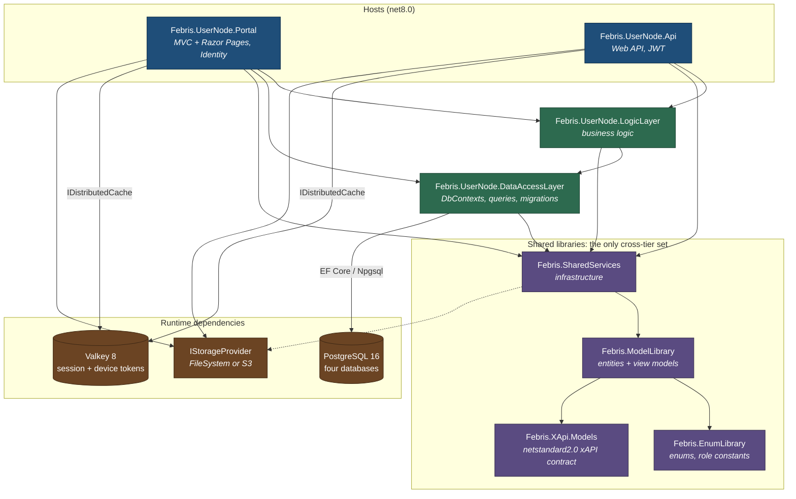
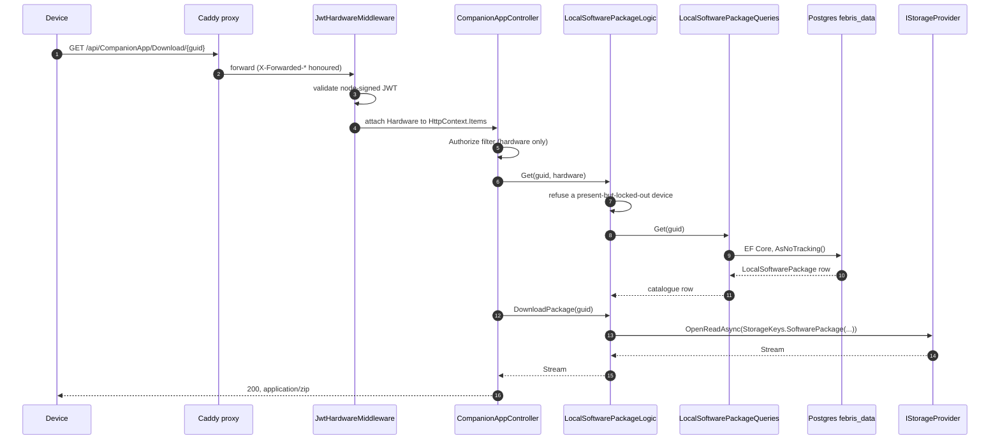

# Architecture

This describes the code in *this* repository: a **Febris node** -- one self-contained LMS
deployment, a web Portal and an HTTP API over Postgres, Valkey and a pluggable artifact store.

A node is standalone. It has no dependency on anything the maintainer runs. That is a structural
property of the code here, not a configuration you choose, and the last section of this document
says exactly what was left out to make it true.

The project is pre-1.0 with a single maintainer. Some of what follows is a description of an
in-progress migration rather than a finished design. Those places are called out.

---

## The projects

Eight projects make up the node, plus three test projects under `tests/`. Directory names are
historical (`FebrisEndUser*`), and assembly names are the current ones.

| Directory | Assembly | Role |
|---|---|---|
| `enduser/FebrisEndUserPortal` | `Febris.UserNode.Portal` | ASP.NET Core MVC + Razor Pages web UI. Owns ASP.NET Identity (cookie auth, roles, 2FA). |
| `enduser/FebrisEndUserApi` | `Febris.UserNode.Api` | ASP.NET Core Web API. Device JWT auth, xAPI ingest, client-software delivery. |
| `enduser/FebrisEndUserBLL` | `Febris.UserNode.LogicLayer` | Business logic. Authorization filters and middleware, xAPI statement handling, health checks. |
| `enduser/FebrisEndUserDAL` | `Febris.UserNode.DataAccessLayer` | EF Core `DbContext`s, migrations, query classes, database provisioning. |
| `shared/FebrisEnumLibrary` | `Febris.EnumLibrary` | Enums and role constants. No dependencies at all. |
| `shared/FebrisModelLibrary` | `Febris.ModelLibrary` | Entities, view models, API contracts. Carries EF Core + Npgsql. |
| `shared/FebrisSharedServices` | `Febris.SharedServices` | Infrastructure: logging, email, JWT signing, the storage seam, transport/CORS policy, xAPI binding. |
| `shared/FebrisXApiModels` | `Febris.XApi.Models` | The xAPI POCO contract, `netstandard2.0`. See [vendoring](#the-xapi-models-vendoring) below. |

`Febris.EnumLibrary`, `Febris.ModelLibrary` and `Febris.SharedServices` are referred to
throughout as **the triad**. They plus `Febris.XApi.Models` are the four libraries a deployment
tier is permitted to share -- a rule the architecture tests enforce, not a guideline.

## Layering

Edges in that diagram are `ProjectReference` entries you can read in the `.csproj` files. Some
notes on the ones that are easy to get wrong:

* **Both hosts reference `Febris.UserNode.LogicLayer`.** Only the Portal additionally references
  `Febris.UserNode.DataAccessLayer` directly, because `AddIdentity(...).AddEntityFrameworkStores<ApplicationDbContext>()`
  needs the context type at the composition root. The API reaches DAL types transitively through
  the logic layer, and only in `Startup`/`Program` (DI registration and the startup database
  provisioner) -- no API controller talks to a `DbContext`.
* **The dependency graph is acyclic by construction.** The DAL references only the triad, so
  "logic depends on data access, never the reverse" is a property MSBuild enforces, not a
  convention. What the architecture tests add is a guard against *new* references being added
  sideways or outside the sanctioned set.
* **`Febris.SharedServices` contains no data access.** It defines no `DbContext` and no query
  classes, and references only the model and enum libraries -- which is what lets it be shared
  with tiers that have no database of their own.

## A request, end to end

`GET /api/CompanionApp/Download/{guid}`: the mobile Server fetching the Companion APK from the
node's distribution store. It touches every layer, so it is a good tracer.

The concrete pieces, in order:

1. **Caddy** terminates TLS and forwards to the API container. `ASPNETCORE_FORWARDEDHEADERS_ENABLED`
   is set so `Request.Scheme` is `https` behind the proxy. LAN clients may instead hit the API's
   plain-HTTP port directly. Only the API is published on that port -- in the compose stack the
   Portal's auth cookie is Secure-only (see [Valkey](#data-and-state) below), so serving the
   Portal over plain HTTP would not work anyway.
2. **`JwtHardwareMiddleware`** (`enduser/FebrisEndUserBLL/Logic/AuthorizationLogic/HardwareKeyAuthorization.cs`,
   wired by `app.UseJwtHardwareMiddleware()` in the API's `Startup`) validates the bearer token
   against the node's own signing key and attaches the resolved principal to `HttpContext.Items`.
   The API validates exactly ONE credential: the **hardware** token a device gets from
   `api/Token/authenticate`. (A second, human-admin bearer token existed while package and module
   ingest lived on the API. Those writes are portal-native now, behind the portal's own cookie
   identity and role gates, and the token is gone with them.)
3. **The controller's `[Authorize]`** is the node's own filter in
   `Febris.UserNode.LogicLayer.Attributes`, not the framework's: no attached hardware means 401,
   and a present-but-revoked device is refused by the same filter.
4. **The logic layer** applies the entitlement check -- here, a present-but-locked-out device is
   refused before anything is read.
5. **The DAL** runs the EF Core query against `febris_data` through Npgsql. Query classes are
   auto-registered `IXxxQueries -> XxxQueries` by naming convention in
   `FebrisUserNodeDataAccessRegistration`.
6. **The storage seam** opens the object and the controller hands the stream straight to
   `File(...)`, so package bytes are never buffered through the logic layer. The catalogue row
   and the bytes are separate concerns: the row lives in Postgres, the bytes in the store.

A second path worth knowing, because it is shaped differently: **xAPI statement ingest**
(`POST /api/Statement/Submit`, with `POST /api/Statement/Backup` as the permissive fallback, and the parameterless `POST /api/Statement` route was retired 2026-08-10) runs controller -> `LauncherLogic` -> `StatementLogic`, which dedupes on
the producer-assigned statement UUID (so a client retry cannot double-commit), resolves the verb
and version, writes a `LocalStatement` row through the xAPI queries into `febris_xapi`, and then
writes a normalised JSON copy of the statement to disk. That last write still goes through the
older `FileServerHandler` / `StaticDetails` path layer rather than `IStorageProvider` -- see
[rough edges](#rough-edges).

## Data and state

**Postgres, four databases on one server.** `febris_user` (ASP.NET Identity), `febris_data`
(tenant domain data), `febris_xapi` (statements), `febris_analytics`. `EndUserDatabaseProvisioner`
runs once at host startup: the three migration-managed contexts get `Migrate()`, the
migration-less `AnalyticsDbContext` gets `EnsureCreated()`. A database whose connection string is
absent from that host's configuration is skipped rather than failing startup. Migrations live in
`enduser/FebrisEndUserDAL/Migrations/{ApplicationDb,DataDb,XApiDb}`.

**Valkey** (a Redis-protocol drop-in, and the compose stack ships Valkey rather than Redis) holds
session tickets and device refresh tokens only -- no data caches. It is **optional**, and
`NodeSessionPolicy.UsesRedisSessionStore` is the switch:

* Configured (the compose default) -- the Portal registers a server-side ticket store, the auth
  cookie is only a key, and it is `SameSite=None` + `SecurePolicy=Always`, so HTTPS is required.
* Not configured -- no ticket store. The ticket lives inside the DataProtection-encrypted cookie,
  which relaxes to `SameSite=Lax` + `SecurePolicy=SameAsRequest` so a node can still be run
  against nothing but a database over plain-HTTP localhost.

**The storage seam.** `IStorageProvider` in `Febris.SharedServices.Storage` is the artifact
boundary: `OpenReadAsync` / `WriteAsync` / `ExistsAsync` / `DeleteAsync` over logical
forward-slash keys, with implementations for the local file system and for S3-compatible object
stores (including MinIO), selected by `Storage:Provider`. The compose default is `FileSystem`
over a named volume, so the quickstart needs no object store. Software packages, modules, video
and portal widget assets go through it.

**DataProtection key ring.** Persisted to a path from `AppKeys:KeyRingPath`, shared by both hosts
via one volume. It encrypts auth cookies and at-rest settings. Losing it logs everyone out.

**Health.** `AddNodeHealthChecks` is ownership-driven: a check is registered only if this host
actually registered the dependency in DI *and* carries its connection string, so an absent
optional subsystem never reads as unhealthy. `/health/ready` reports each database separately.

## How the layering is enforced

`tests/FebrisArchitectureTests` is a build-time guard, not documentation. It has **no
`ProjectReference` items at all** -- it parses the other projects' `.csproj` and `.cs` files from
disk. That is deliberate: a guard that referenced the projects it polices could itself drag one
across the boundary.

**`ProjectGraph.cs`** is the shared helper. It walks up from the test assembly to find the repo
root -- identified as the directory containing `enduser/` and `shared/` -- then parses
`ProjectReference` elements into a direct and a transitive reference graph, skipping anything
under `bin/` or `obj/`.

**`EdgeBoundaryTests.cs`** polices the trust boundary. An "edge" is a deployment that runs
somewhere the maintainer does not control, and `enduser/` is one. Three assertions:

1. Every project under an edge root may reference **only** `Febris.EnumLibrary`,
   `Febris.ModelLibrary`, `Febris.SharedServices`, `Febris.XApi.Models`, and other edge projects.
   Anything else is a failure.
2. Those four libraries must themselves stay clean, transitively -- otherwise the allowlist would
   be meaningless, since a sanctioned library could smuggle a forbidden dependency into every
   edge deployment.
3. The grandfathered-exception list must contain no stale entries: every listed exception has to
   correspond to a reference that still exists, so the list can only shrink.

The exception list is currently **empty**, and the file is explicit that adding to it requires a
tracked remediation plan.

**`DuplicateTypeGuardTests.cs`** polices duplication drift -- the same type name defined in two
projects, which then silently diverges. It scans type declarations across the source tree and
compares the set of cross-project duplicates against a frozen baseline file
(`tests/FebrisArchitectureTests/DuplicateTypeBaseline.txt`). Two assertions: **no new duplicate**
may appear outside the baseline, and the baseline may contain **no stale entries** -- once a type
is consolidated its line must be deleted. It is a ratchet: existing debt is visible and can only
go down. The guard does not try to judge whether a given duplicate is legitimate. It cannot, and
it does not pretend to. The correct fix for a new failure is to reference the existing type or
extract it to a shared project, never to add a line to the baseline.

When one of these fails, the assertion message names the offending projects and file paths.

## What is intentionally not here

Febris also has a hub -- a central multi-tenant service the maintainer runs. **None of it is in
this repository, and none of it is planned to be.** Specifically absent:

* **The hub itself** -- the central API, admin portal, SSO service and background workers.
* **The marketplace and the central content catalogue authority.** A node serves its own
  catalogue from its own database.
* **Commerce and billing** -- the purchase, invoicing and seat-issuance authority.
* **CRM.**
* **Licence issuance.** A node has no licence key, validates nothing against anyone, and does
  not phone home. The compose stack blanks the legacy hub credentials explicitly.

A node is not a client of any of that. There is no degraded mode, no trial timer, no
"unregistered" state.

Two honest qualifications, because the code will show you both:

**There is a federation seam, and it is closed.** `HubFederationSettingsResolver` in the DAL
resolves a single gate, database-first (a stored config row) then configuration, and defaults
**closed** -- no row and no config means local-only with zero hub credentials. Unsubstituted
deploy placeholders also resolve closed. The one always-registered health check is the hub probe,
and a closed gate reports *healthy* ("hub federation disabled"), so a standalone node is never
reported as degraded for having no hub. The compose stack ships the gate closed and that is the
only configuration this repository supports.

**Some client-side code for hub-backed features is still present.** The DAL splits its query
classes into `Local/` (backed by this node's own `DbContext`s) and `Remote/` (HTTP calls to a hub
API). Business logic for marketplace listings, purchases and invoices exists and reads through
those `Remote` queries. With the gate closed those paths are inert. They are residue of the
carve-out, not a hidden dependency: the launch path, for example, was deliberately moved off a
central seat check onto the node's own `HardwareLinkedModule` link, so the central commerce
dependency was removed rather than stubbed.

## The xAPI models vendoring

`shared/FebrisXApiModels` (`Febris.XApi.Models`) is the xAPI contract keystone: the pure xAPI
POCOs and their interfaces on `netstandard2.0`, so every tier -- this node on net8, and the client
tiers that are not in this repository -- can consume one contract. The heavy net8
`Febris.ModelLibrary` (EF Core, Npgsql) references *it*, never the reverse, which is what keeps
the contract free of data-access weight.

**In this first cut it is vendored source**, built from `shared/FebrisXApiModels` as a
`ProjectReference`. It is intended to become a published NuGet package. When that lands, the
`ProjectReference` in `Febris.ModelLibrary.csproj` becomes a `PackageReference` and this
directory goes away. Until then, treat the types here as the canonical definition and expect the
directory to disappear in a future release.

The namespaces (`Febris.ModelLibrary.Models.XApiModels`,
`Febris.ModelLibrary.Interfaces.XApiModelInterfaces`) deliberately do not match the assembly
name, so that the eventual package swap requires no `using` changes anywhere.

## Rough edges

Stated plainly, because you will find them:

* **Two file-access paths coexist.** `IStorageProvider` is the intended seam and the artifact
  store uses it, but older code -- including the raw xAPI statement JSON write -- still goes
  through `FileServerHandler` and `StaticDetails`. Migrating the remainder is unfinished work.
* **Legacy namespaces in the logic layer.** 20 of the 81 source files in
  `enduser/FebrisEndUserBLL` still declare the pre-rename `Febris.PrimaryLogicLayer.*` namespace.
  The other 61 use `Febris.UserNode.*`, as does every namespaced file in the API, Portal and DAL.
  The assembly name is `Febris.UserNode.LogicLayer` throughout. A `using` for
  `Febris.PrimaryLogicLayer.Logic.*` next to one for `Febris.UserNode.LogicLayer.Logic.*` is not a
  mistake -- both resolve inside the same assembly.
* **The duplicate-type baseline is not a clean slate.** It records real pre-existing duplication
  as tracked debt. The ratchet stops it growing. It does not mean the debt is small.
* **Some query classes still carry a legacy self-newing constructor** alongside the DI one, a
  strangler pattern that has not finished. New code should use DI.

## See also

* [`SELF_HOSTING.md`](../SELF_HOSTING.md) -- running a node: prerequisites, the compose stack,
  configuration, TLS, backups, upgrades.
* [`CONTRIBUTING.md`](../CONTRIBUTING.md) -- building, testing, and the rules a pull request must
  not break.
